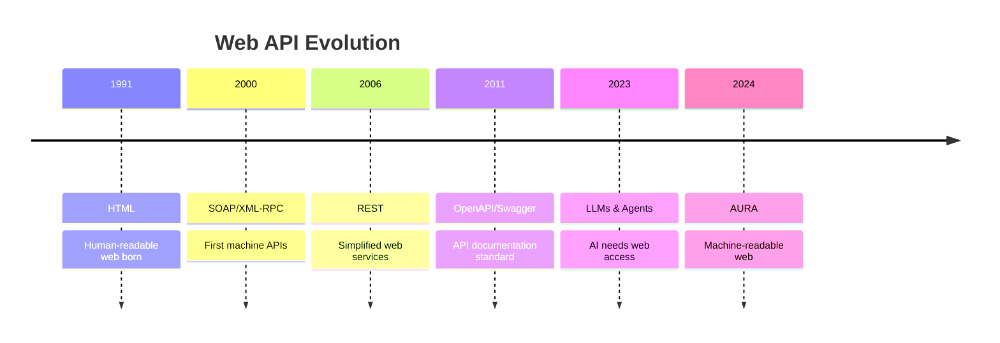
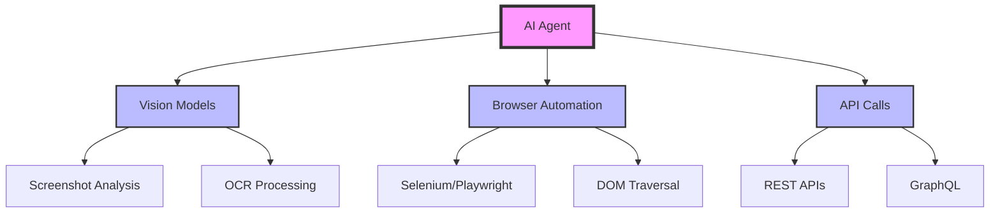
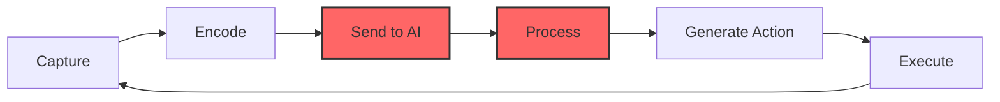
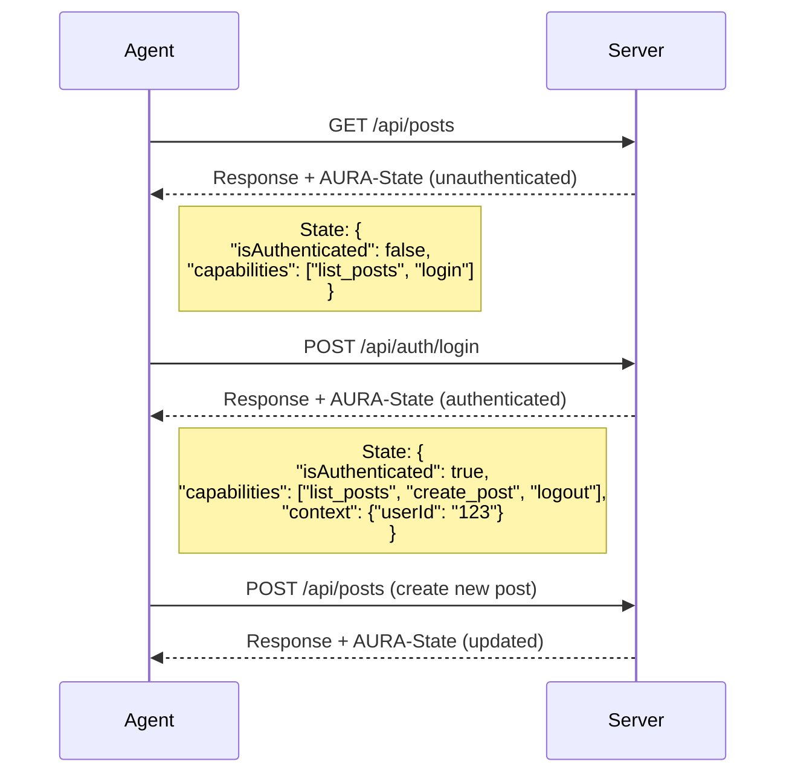
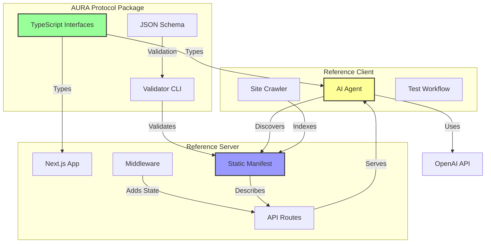
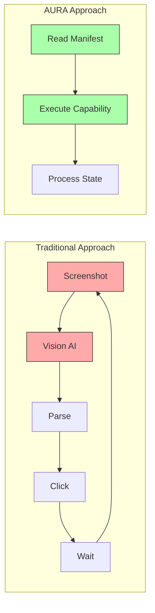
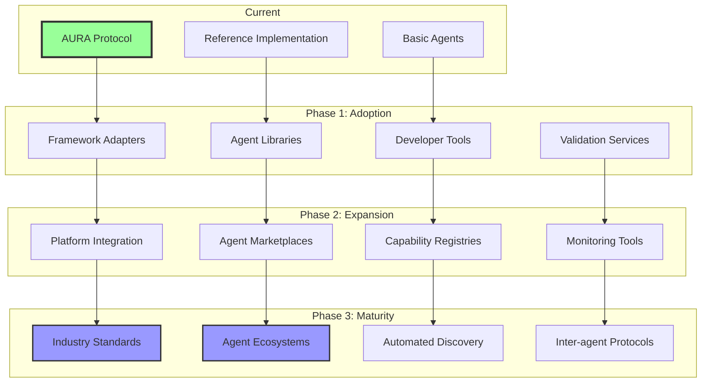

# AURA Protocol

## The Machine-Readable Web

<div class="pt-12">
  <span @click="$slidev.nav.next" class="px-2 py-1 rounded cursor-pointer" hover="bg-white bg-opacity-10">
    Making websites understandable for AI agents <carbon:arrow-right class="inline"/>
  </span>
</div>

<div class="abs-br m-6 flex gap-2">
  <a href="https://github.com/osmandkitay/aura" target="_blank" alt="GitHub" title="Open in GitHub"
    class="text-xl slidev-icon-btn opacity-50 !border-none !hover:text-white">
    <carbon-logo-github />
  </a>
</div>

---

transition: fade-out
layout: two-cols
----------------

# The Evolution of Web Protocols

<div class="text-sm">

From human-readable to machine-readable

</div>

::left::

## Timeline of Web APIs



::right::

## Key Milestones

| Year | Protocol          | Purpose                |
| ---- | ----------------- | ---------------------- |
| 1991 | **HTML**    | Display for humans     |
| 1998 | **XML-RPC** | Remote procedures      |
| 2000 | **SOAP**    | Enterprise integration |
| 2006 | **REST**    | Resource-based APIs    |
| 2011 | **GraphQL** | Query language         |
| 2015 | **OpenAPI** | API documentation      |
| 2024 | **AURA**    | AI agent interaction   |

<div class="mt-4 text-xs text-gray-400">
Each evolution addressed specific limitations of its predecessors
</div>

---

layout: center
class: text-center
------------------

# The Problem Space

<div class="text-xl text-gray-400 mb-8">
How do AI agents interact with websites today?
</div>

<div class="grid grid-cols-3 gap-4">
  <div class="bg-red-500/10 p-6 rounded-lg">
    <div class="text-3xl mb-4">🖼️</div>
    <h3 class="text-lg font-bold mb-2">Screen Scraping</h3>
    <p class="text-sm text-gray-400">Agents "look" at pixels and guess where to click</p>
    <div class="mt-4 text-xs">
      ❌ Expensive<br/>
      ❌ Fragile<br/>
      ❌ Slow
    </div>
  </div>

<div class="bg-yellow-500/10 p-6 rounded-lg">
    <div class="text-3xl mb-4">🏗️</div>
    <h3 class="text-lg font-bold mb-2">DOM Manipulation</h3>
    <p class="text-sm text-gray-400">Parse complex HTML structures</p>
    <div class="mt-4 text-xs">
      ❌ Inconsistent<br/>
      ❌ Breaks often<br/>
      ❌ Site-specific
    </div>
  </div>

<div class="bg-orange-500/10 p-6 rounded-lg">
    <div class="text-3xl mb-4">🔒</div>
    <h3 class="text-lg font-bold mb-2">No Control</h3>
    <p class="text-sm text-gray-400">Sites can't limit or guide agent actions</p>
    <div class="mt-4 text-xs">
      ❌ Security risks<br/>
      ❌ No consent<br/>
      ❌ Unpredictable
    </div>
  </div>
</div>

---

transition: slide-up
--------------------

# Current State: AI Agents in 2024

<div class="grid grid-cols-2 gap-8">

<div>

## Agent Capabilities



</div>

<div>

## Popular AI Agents

| Agent                         | Method          | Limitations    |
| ----------------------------- | --------------- | -------------- |
| **GPT-4 Vision**        | Screenshots     | Token cost     |
| **Claude Computer Use** | Screen + clicks | Latency        |
| **Browser Agents**      | DOM parsing     | Fragility      |
| **AutoGPT**             | Multiple tools  | Complexity     |
| **LangChain Agents**    | Tool chains     | Setup overhead |

<div class="mt-6 p-4 bg-blue-500/10 rounded">
<div class="text-sm font-bold mb-2">💡 Key Insight</div>
<div class="text-xs">All current methods treat websites as black boxes, guessing at functionality rather than understanding declared capabilities.</div>
</div>

</div>

</div>

---

layout: image-right
image: https://images.unsplash.com/photo-1633356122102-3fe601e05bd2?w=1920
--------------------------------------------------------------------------

# The Cost of Screen Scraping

## Token Economics

<div class="text-sm">

Current AI vision models consume massive tokens:

| Operation             | Tokens Used  | Cost (GPT-4V) |
| --------------------- | ------------ | ------------- |
| Screenshot analysis   | ~1,000-2,000 | $0.01-0.02    |
| Multi-step navigation | ~10,000+     | $0.10+        |
| Form filling          | ~5,000       | $0.05         |
| Data extraction       | ~3,000       | $0.03         |

</div>

## Time Complexity



<div class="text-xs mt-4 text-gray-400">
Each interaction cycle: 2-5 seconds minimum
</div>

---

transition: slide-left
layout: center
--------------

# Enter AURA

<div class="text-2xl text-gray-400 mb-8">
Agent-Usable Resource Assertion
</div>

<div class="text-lg">
Instead of guessing how to interact with a website...
</div>

<div class="mt-8 p-6 bg-gradient-to-r from-blue-500/20 to-purple-500/20 rounded-lg">
<div class="text-xl font-bold mb-4">Websites Declare Their Capabilities</div>

```json
{
  "capabilities": {
    "create_post": {
      "description": "Create a new blog post",
      "action": {
        "method": "POST",
        "urlTemplate": "/api/posts"
      }
    }
  }
}
```

</div>

<div class="mt-6 text-sm text-gray-400">
A fundamental shift from imperative guessing to declarative interaction
</div>

---

# AURA Architecture

```mermaid
graph TB
    subgraph Website
        M[/.well-known/aura.json<br/>Manifest]
        API[API Endpoints]
        S[AURA-State Header]
    end
  
    subgraph AI Agent
        D[Discover Manifest]
        P[Parse Capabilities]
        E[Execute Actions]
        C[Manage Context]
    end
  
    D -->|GET /.well-known/aura.json| M
    P -->|Understand| M
    E -->|HTTP Requests| API
    API -->|Response + State| S
    S -->|Update Context| C
    C -->|Next Action| E
  
    style M fill:#9f9,stroke:#333,stroke-width:3px
    style S fill:#99f,stroke:#333,stroke-width:2px
    style D fill:#ff9,stroke:#333,stroke-width:2px
```

<div class="mt-6 grid grid-cols-3 gap-4 text-sm">
  <div class="p-3 bg-green-500/10 rounded">
    <strong>Manifest:</strong> Declares all capabilities
  </div>
  <div class="p-3 bg-blue-500/10 rounded">
    <strong>State Header:</strong> Dynamic context
  </div>
  <div class="p-3 bg-yellow-500/10 rounded">
    <strong>Agent:</strong> Autonomous execution
  </div>
</div>

---

layout: two-cols
----------------

# Core Concepts

::left::

## 1. Manifest File

Located at `/.well-known/aura.json`

```json
{
  "protocol": "AURA",
  "version": "1.0",
  "site": {
    "name": "My Blog",
    "url": "https://blog.example.com"
  },
  "resources": {
    "posts": {
      "uriPattern": "/api/posts/{id}",
      "operations": {
        "GET": { "capabilityId": "read_post" },
        "PUT": { "capabilityId": "update_post" }
      }
    }
  },
  "capabilities": { ... }
}
```

::right::

## 2. Capabilities

Discrete, self-contained actions

```json
{
  "list_posts": {
    "id": "list_posts",
    "v": 1,
    "description": "List all blog posts",
    "parameters": {
      "type": "object",
      "properties": {
        "limit": { "type": "number" },
        "tags": { 
          "type": "array",
          "items": { "type": "string" }
        }
      }
    },
    "action": {
      "type": "HTTP",
      "method": "GET",
      "urlTemplate": "/api/posts{?limit,tags*}"
    }
  }
}
```

---

# AURA vs OpenAPI

<div class="grid grid-cols-2 gap-6">

<div>

## OpenAPI Approach

```yaml
/api/posts/{postId}:
  get:
    summary: Get a blog post
    operationId: getPost
    parameters:
      - name: postId
        in: path
        required: true
        schema:
          type: string
          format: uuid
      - name: include
        in: query
        schema:
          type: array
          items:
            type: string
    responses:
      200:
        description: Successful response
        content:
          application/json:
            schema:
              $ref: '#/components/schemas/Post'
      404:
        description: Post not found
```

<div class="text-xs mt-2 text-gray-400">
Focus: HTTP details, response schemas, error codes
</div>

</div>

<div>

## AURA Approach

```json
{
  "read_post": {
    "id": "read_post",
    "v": 1,
    "description": "Read a specific blog post",
    "parameters": {
      "type": "object",
      "required": ["id"],
      "properties": {
        "id": { "type": "string" }
      }
    },
    "action": {
      "type": "HTTP",
      "method": "GET",
      "urlTemplate": "/api/posts/{id}",
      "parameterMapping": {
        "id": "/id"
      }
    }
  }
}
```

<div class="text-xs mt-2 text-gray-400">
Focus: Capabilities, simplicity, agent understanding
</div>

</div>

</div>

---

# Comparison Table

| Aspect                      | Traditional APIs        | OpenAPI                 | AURA                                    |
| --------------------------- | ----------------------- | ----------------------- | --------------------------------------- |
| **Purpose**           | System integration      | Developer documentation | AI agent interaction                    |
| **Discovery**         | None                    | Variable location       | Standardized `/.well-known/aura.json` |
| **Complexity**        | Implementation-specific | Comprehensive specs     | Simplified, declarative                 |
| **State Management**  | Session/tokens          | Stateless               | `AURA-State` header                   |
| **Versioning**        | URL/header              | API-wide                | Per-capability                          |
| **Auth Approach**     | Multiple schemes        | Detailed security       | Simple hints                            |
| **Target Audience**   | Developers              | Developers              | AI Agents                               |
| **Token Efficiency**  | N/A                     | N/A                     | Optimized for LLMs                      |
| **Context Awareness** | No                      | No                      | Yes                                     |
| **Action Discovery**  | Documentation           | Spec parsing            | Automatic                               |

<div class="mt-6 p-4 bg-gradient-to-r from-green-500/10 to-blue-500/10 rounded">
<div class="text-sm">
<strong>Key Differentiator:</strong> AURA is designed from the ground up for autonomous agents, not human developers
</div>
</div>

---

layout: center
--------------

# The AURA-State Header

<div class="text-lg text-gray-400 mb-6">
Dynamic context that evolves with each interaction
</div>



<div class="mt-6 text-sm">
The state header enables context-aware interactions without complex session management
</div>

---

# Real-World Example

<div class="grid grid-cols-2 gap-4">

<div>

## Agent Task

"Create a blog post about AI"

## Discovery Phase

```typescript
// 1. Check for AURA manifest
const manifest = await fetch(
  'https://blog.example.com/.well-known/aura.json'
);

// 2. Parse capabilities
const { capabilities } = await manifest.json();

// 3. Find relevant capability
const createPost = capabilities['create_post'];
```

</div>

<div>

## Execution Phase

```typescript
// 4. Prepare parameters
const params = {
  title: "The Future of AI",
  content: "AI is transforming...",
  tags: ["ai", "technology"]
};

// 5. Execute capability
const response = await fetch(
  createPost.action.urlTemplate,
  {
    method: createPost.action.method,
    body: JSON.stringify(params),
    headers: {
      'Content-Type': 'application/json'
    }
  }
);

// 6. Check state header
const state = JSON.parse(
  atob(response.headers.get('AURA-State'))
);
```

</div>

</div>

<div class="mt-4 text-xs text-gray-400">
Total time: ~500ms | Tokens used: ~100 | Cost: <$0.001
</div>

---

transition: fade
----------------

# Implementation Architecture



---

layout: two-cols
----------------

# Benefits for Different Stakeholders

::left::

## For Website Owners

✅ **Control** - Define exactly what agents can do

✅ **Security** - No more screen scraping vulnerabilities

✅ **Efficiency** - Direct API calls vs. UI automation

✅ **Analytics** - Track agent interactions

✅ **Monetization** - Potential for agent-specific pricing

## For Developers

✅ **Simple Implementation** - Just add a JSON file

✅ **Framework Agnostic** - Works with any backend

✅ **Progressive Enhancement** - Add capabilities gradually

✅ **TypeScript Support** - Full type safety

::right::

## For AI Agents

✅ **Discovery** - Automatic capability detection

✅ **Reliability** - No more brittle selectors

✅ **Speed** - Direct API access

✅ **Context** - State-aware interactions

✅ **Efficiency** - Minimal token usage

## For End Users

✅ **Better Automation** - More reliable AI assistants

✅ **Faster Results** - No waiting for screenshots

✅ **Lower Costs** - Reduced API token usage

✅ **More Capabilities** - Agents can do more

---

layout: center
class: text-center
------------------

# Performance Comparison

<div class="mt-8">

| Method                    | Time per Action | Tokens Used | Cost        | Reliability |
| ------------------------- | --------------- | ----------- | ----------- | ----------- |
| **Screen Scraping** | 3-5 seconds     | 1,000-2,000 | $0.01-0.02  | ~70%        |
| **DOM Parsing**     | 1-2 seconds     | 500-1,000   | $0.005-0.01 | ~80%        |
| **AURA Protocol**   | 100-500ms       | 50-200      | <$0.001     | ~99%        |

</div>

<div class="mt-8">



</div>

---

# Security & Privacy

<div class="grid grid-cols-2 gap-8">

<div>

## Security Features

🔒 **Capability-Based Access**

- Explicit permission model
- No unauthorized actions

🎯 **Rate Limiting**

- Built into protocol
- Machine-readable limits

🔑 **Authentication Hints**

- Standard auth patterns
- State-based access control

🛡️ **CORS Support**

- Browser-agent compatibility
- Cross-origin safety

</div>

<div>

## Privacy Considerations

```json
{
  "policy": {
    "rateLimit": {
      "limit": 120,
      "window": "minute"
    },
    "authHint": "cookie",
    "dataUsage": {
      "collection": "minimal",
      "retention": "session",
      "sharing": "none"
    }
  }
}
```

<div class="mt-4 p-4 bg-blue-500/10 rounded">
<div class="text-sm">
Websites maintain full control over what agents can access and how often
</div>
</div>

</div>

</div>

---

layout: image-right
image: https://images.unsplash.com/photo-1451187580459-43490279c0fa?w=1920
--------------------------------------------------------------------------

# Future Vision

## The Semantic Web Realized

<div class="text-sm">

### Near Term (2025)

- Browser extensions for AURA
- Major frameworks adapters
- Search engine support

### Medium Term (2026)

- Standard adoption by platforms
- Agent marketplaces
- Capability composition

### Long Term (2027+)

- Web 3.0: Fully machine-readable
- Autonomous agent economy
- Inter-agent protocols

</div>

<div class="mt-6 p-4 bg-gradient-to-r from-blue-500/20 to-purple-500/20 rounded">
<div class="text-xs">
"AURA isn't just about making websites accessible to AI - it's about creating a new layer of the internet where machines and humans coexist seamlessly."
</div>
</div>

---

# Ecosystem Growth



---

layout: two-cols
----------------

# Getting Started

::left::

## For Website Owners

1. **Create Manifest**

```json
// /.well-known/aura.json
{
  "protocol": "AURA",
  "version": "1.0",
  "capabilities": { ... }
}
```

2. **Add State Headers**

```typescript
// middleware.ts
response.headers.set(
  'AURA-State',
  btoa(JSON.stringify(state))
);
```

3. **Validate**

```bash
npx aura-validate manifest.json
```

::right::

## For Agent Developers

1. **Discover Capabilities**

```typescript
const manifest = await fetch(
  `${url}/.well-known/aura.json`
);
```

2. **Execute Actions**

```typescript
const capability = manifest
  .capabilities[action];
await executeCapability(
  capability, 
  parameters
);
```

3. **Handle State**

```typescript
const state = parseAuraState(
  response.headers
);
updateContext(state);
```

---

layout: center
--------------

# Try It Now

<div class="text-xl mb-8">Experience AURA in action</div>

<div class="grid grid-cols-2 gap-8">

<div class="p-6 bg-blue-500/10 rounded-lg">

### 1. Clone & Install

```bash
git clone https://github.com/osmandkitay/aura
cd aura
pnpm install
```

</div>

<div class="p-6 bg-green-500/10 rounded-lg">

### 2. Start Server

```bash
pnpm --filter aura-reference-server dev
# Visit http://localhost:3000/.well-known/aura.json
```

</div>

<div class="p-6 bg-yellow-500/10 rounded-lg">

### 3. Run Agent

```bash
# Add OpenAI key to .env
pnpm --filter aura-reference-client agent \
  -- http://localhost:3000 \
  "list all blog posts"
```

</div>

<div class="p-6 bg-purple-500/10 rounded-lg">

### 4. Run Crawler

```bash
pnpm --filter aura-reference-client crawler \
  -- http://localhost:3000
```

</div>

</div>

---

layout: center
class: text-center
------------------

# Join the Revolution

<div class="text-xl text-gray-400 mb-8">
Help us build the machine-readable web
</div>

<div class="flex justify-center gap-8 mb-8">
  <a href="https://github.com/osmandkitay/aura" class="px-6 py-3 bg-blue-500 rounded-lg hover:bg-blue-600 transition">
    <carbon-logo-github class="inline mr-2" /> GitHub Repository
  </a>
  <a href="https://npmjs.com/package/aura-protocol" class="px-6 py-3 bg-green-500 rounded-lg hover:bg-green-600 transition">
    <carbon-package class="inline mr-2" /> NPM Package
  </a>
</div>

<div class="grid grid-cols-3 gap-4 text-sm">
  <div class="p-4 rounded-lg bg-gray-800">
    <div class="text-2xl mb-2">🛠️</div>
    <strong>Build</strong>
    <div class="text-xs text-gray-400">Create adapters and tools</div>
  </div>
  <div class="p-4 rounded-lg bg-gray-800">
    <div class="text-2xl mb-2">🧪</div>
    <strong>Test</strong>
    <div class="text-xs text-gray-400">Implement on your sites</div>
  </div>
  <div class="p-4 rounded-lg bg-gray-800">
    <div class="text-2xl mb-2">📢</div>
    <strong>Share</strong>
    <div class="text-xs text-gray-400">Spread the word</div>
  </div>
</div>

<div class="mt-8 text-xs text-gray-500">
AURA is open source (MIT License) - a public good for the internet
</div>

---

layout: end
class: text-center
------------------

# Thank You

<div class="text-xl text-gray-400 mb-4">
Questions?
</div>

<div class="text-sm">

**GitHub**: [github.com/osmandkitay/aura](https://github.com/osmandkitay/aura)

**NPM**: [npmjs.com/package/aura-protocol](https://npmjs.com/package/aura-protocol)

**Contact**: via GitHub Issues

</div>

<div class="mt-8 text-xs text-gray-500">
The future of the web is declarative, not imperative
</div>
