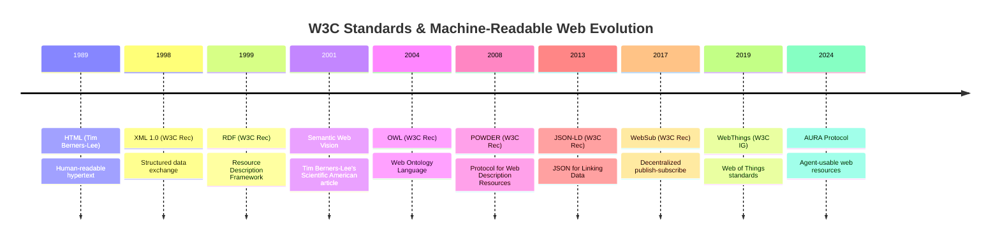
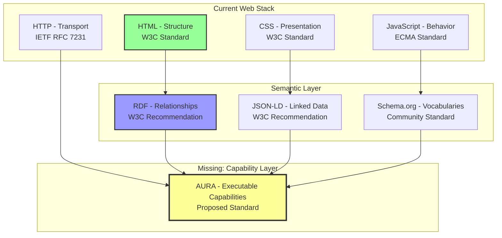
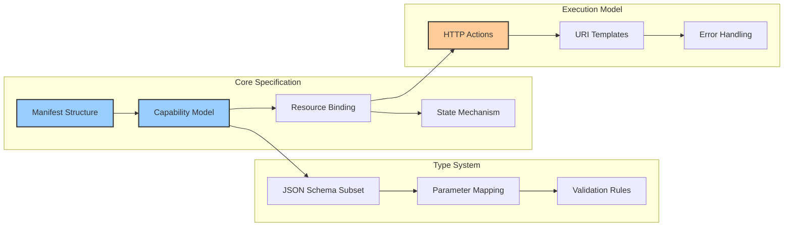
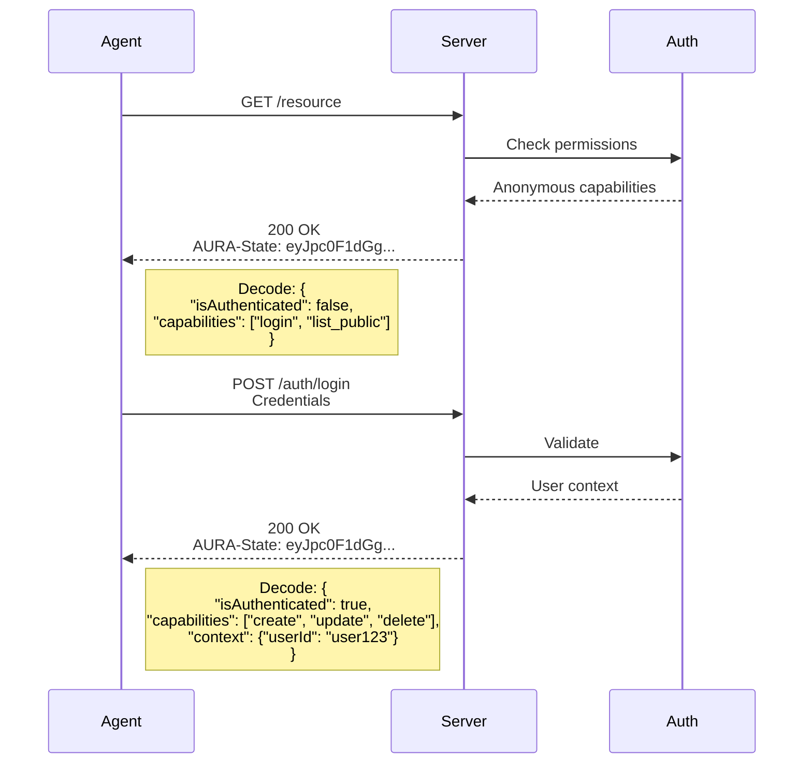
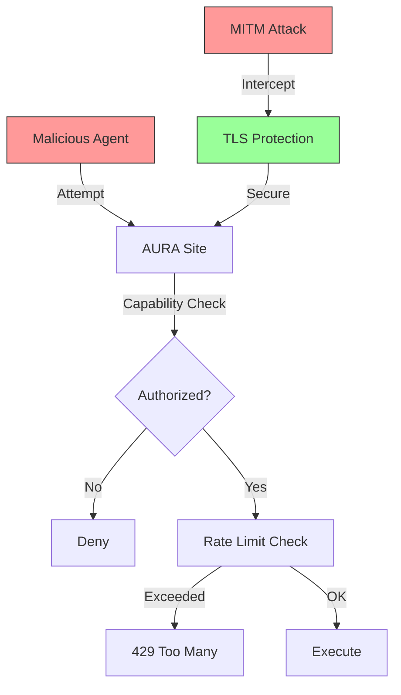
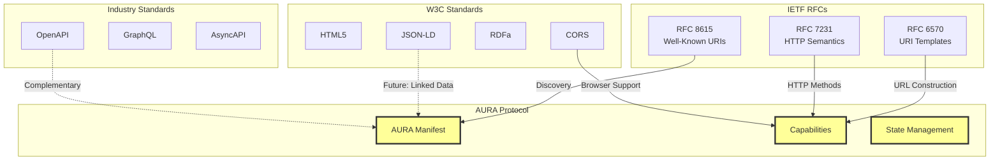
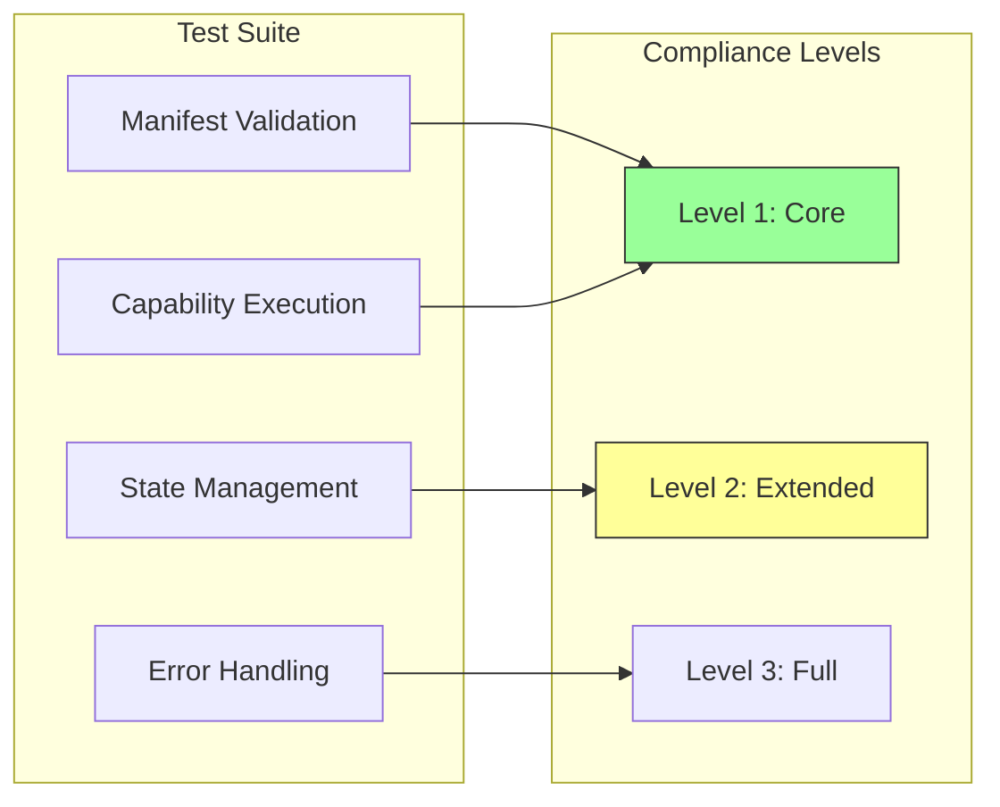
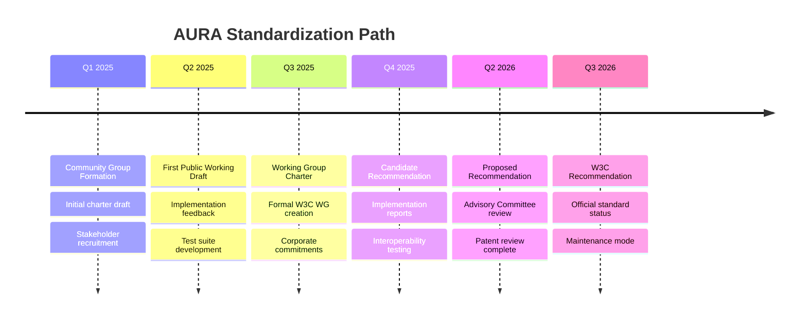

# AURA Protocol

## Agent-Usable Resource Assertion

### A Standards-Based Approach to Machine-Readable Web Resources

<div class="pt-8">
  <div class="text-lg text-gray-400">
    Presentation to the World Wide Web Consortium
  </div>
</div>

<div class="abs-br m-6 text-xs text-gray-400">
  Building on RFC 8615, RFC 6570, and W3C Semantic Web standards
</div>

---
layout: two-cols
---

# Agenda

::left::

## Part I: Foundation
1. Historical Context & W3C Standards Evolution
2. The Semantic Web Vision Revisited
3. Current Gap Analysis

## Part II: AURA Protocol
4. Protocol Architecture & Design Principles
5. Standards Compliance & Interoperability
6. Formal Specification Overview

::right::

## Part III: Integration
7. Alignment with W3C Recommendations
8. Compatibility with Existing Standards
9. Reference Implementation

## Part IV: Future
10. Standardization Roadmap
11. Governance Model
12. Call to Action

---
transition: fade-out
---

# The Evolution of Web Standards



---
layout: center
---

# The Original Semantic Web Vision

<div class="mb-6 text-gray-400">
"The Semantic Web is not a separate Web but an extension of the current one,<br/>
in which information is given well-defined meaning,<br/>
better enabling computers and people to work in cooperation."
</div>

<div class="text-sm text-right text-gray-500">
— Tim Berners-Lee, James Hendler, Ora Lassila (2001)
</div>

<div class="mt-8 grid grid-cols-2 gap-8">

<div class="p-6 bg-blue-500/10 rounded-lg">
<h3 class="font-bold mb-4">Original Goals</h3>

- Machine-understandable content
- Automated reasoning
- Agent-based interactions
- Distributed knowledge graphs

</div>

<div class="p-6 bg-green-500/10 rounded-lg">
<h3 class="font-bold mb-4">What We Got</h3>

- Schema.org microdata
- Knowledge Graph (Google)
- Linked Open Data
- Limited agent capabilities

</div>

</div>

<div class="mt-6 p-4 bg-yellow-500/10 rounded text-sm">
<strong>The Gap:</strong> While we achieved structured data, we lack a standard for <em>executable capabilities</em>
</div>

---

# Standards Foundation

## AURA Builds Upon Established Standards

| Standard | Organization | Year | AURA Usage |
|----------|--------------|------|------------|
| **RFC 8615** | IETF | 2019 | Well-Known URIs (`/.well-known/`) |
| **RFC 6570** | IETF | 2012 | URI Template specification |
| **RFC 7231** | IETF | 2014 | HTTP/1.1 Semantics |
| **RFC 8259** | IETF | 2017 | JSON data format |
| **JSON Schema** | JSON Schema Org | 2020 | Parameter validation |
| **RFC 6901** | IETF | 2013 | JSON Pointer for parameter mapping |
| **CORS** | W3C | 2014 | Cross-Origin Resource Sharing |
| **JSON-LD** | W3C | 2014 | Future context expansion |

<div class="mt-6 p-4 bg-blue-500/10 rounded">
<div class="text-sm">
<strong>Design Principle:</strong> AURA introduces no new transport mechanisms or data formats,<br/>
only a standardized structure for declaring and discovering web capabilities
</div>
</div>

---
layout: two-cols
---

# Comparison with W3C Standards

::left::

## RDF/OWL Approach

```turtle
@prefix : <http://example.org/blog#> .
@prefix rdf: <http://www.w3.org/1999/02/22-rdf-syntax-ns#> .
@prefix rdfs: <http://www.w3.org/2000/01/rdf-schema#> .
@prefix owl: <http://www.w3.org/2002/07/owl#> .

:BlogPost rdf:type owl:Class ;
    rdfs:label "Blog Post" .

:createPost rdf:type owl:ObjectProperty ;
    rdfs:domain :Blog ;
    rdfs:range :BlogPost ;
    rdfs:label "creates a post" .

:hasTitle rdf:type owl:DatatypeProperty ;
    rdfs:domain :BlogPost ;
    rdfs:range xsd:string .
```

**Focus:** Ontology and relationships

::right::

## AURA Approach

```json
{
  "capabilities": {
    "create_post": {
      "id": "create_post",
      "v": 1,
      "description": "Creates a blog post",
      "parameters": {
        "type": "object",
        "required": ["title"],
        "properties": {
          "title": {"type": "string"}
        }
      },
      "action": {
        "type": "HTTP",
        "method": "POST",
        "urlTemplate": "/api/posts"
      }
    }
  }
}
```

**Focus:** Executable capabilities

---

# The Missing Layer



---
layout: center
---

# Protocol Architecture

## Three Core Components

<div class="grid grid-cols-3 gap-6 mt-8">

<div class="p-6 bg-gradient-to-b from-blue-500/20 to-blue-500/10 rounded-lg">
<h3 class="text-lg font-bold mb-4">1. Discovery Mechanism</h3>

**RFC 8615 Compliant**

```
GET /.well-known/aura.json
```

- Predictable location
- No registration required
- Cache-friendly
- Web-scale compatible

</div>

<div class="p-6 bg-gradient-to-b from-green-500/20 to-green-500/10 rounded-lg">
<h3 class="text-lg font-bold mb-4">2. Capability Declaration</h3>

**JSON Schema Based**

```json
{
  "protocol": "AURA",
  "version": "1.0",
  "capabilities": {}
}
```

- Self-describing
- Version controlled
- Machine validatable
- Human readable

</div>

<div class="p-6 bg-gradient-to-b from-purple-500/20 to-purple-500/10 rounded-lg">
<h3 class="text-lg font-bold mb-4">3. State Management</h3>

**HTTP Header Based**

```
AURA-State: <base64-json>
```

- Stateless protocol
- Context preservation
- Standard HTTP
- Backward compatible

</div>

</div>

---

# Formal Specification Structure

## AURA Protocol v1.0 Components



<div class="mt-6 grid grid-cols-2 gap-4 text-sm">
<div class="p-3 bg-blue-500/10 rounded">
<strong>Normative:</strong> Manifest schema, capability structure, state format
</div>
<div class="p-3 bg-yellow-500/10 rounded">
<strong>Informative:</strong> Implementation guidance, security considerations
</div>
</div>

---

# Capability Model

## Formal Definition

<div class="text-sm">

A **capability** in AURA is a tuple ⟨I, V, D, P, A⟩ where:

- **I** (Identifier): Unique string identifier within the manifest scope
- **V** (Version): Monotonically increasing integer for breaking changes
- **D** (Description): Human-readable string describing the capability
- **P** (Parameters): JSON Schema defining accepted input parameters
- **A** (Action): Execution specification mapping parameters to HTTP requests

</div>

## Properties

<div class="grid grid-cols-2 gap-6 mt-4 text-sm">

<div>

### Deterministic Execution
```
∀ capability c, parameters p:
  execute(c, p) → HTTP Request
```

The same parameters always produce the same HTTP request

</div>

<div>

### Version Independence
```
capabilities[id].v = n
capabilities[id].v = n+1
```

Multiple versions can coexist for backward compatibility

</div>

</div>

---

# URI Template Compliance

## RFC 6570 Integration

AURA adopts RFC 6570 URI Templates for flexible, standards-based URL construction:

<div class="grid grid-cols-2 gap-6 mt-6">

<div>

### Template Expressions

| Expression | Example | Expansion |
|------------|---------|-----------|
| Simple | `{id}` | `/posts/123` |
| Reserved | `{+path}` | `/posts/2024/12/title` |
| Fragment | `{#section}` | `#introduction` |
| Query | `{?q,limit}` | `?q=search&limit=10` |
| Continuation | `{&page}` | `&page=2` |
| Path | `{/path*}` | `/one/two/three` |
| Explode | `{?tags*}` | `?tags=ai&tags=web` |

</div>

<div>

### AURA Usage

```json
{
  "action": {
    "urlTemplate": "/api{/version}/posts{/id}{?fields,tags*}",
    "parameterMapping": {
      "version": "/version",
      "id": "/id", 
      "fields": "/fields",
      "tags": "/tags"
    }
  }
}
```

Results in: `/api/v1/posts/123?fields=title,content&tags=ai&tags=ml`

</div>

</div>

---

# State Management Protocol

## AURA-State Header Specification



---

# Alignment with W3C Goals

## Supporting W3C Design Principles

<div class="grid grid-cols-2 gap-6">

<div>

### Web for All
✅ **Accessibility**: Machine-readable by design
✅ **Internationalization**: UTF-8 throughout
✅ **Device Independence**: HTTP-based
✅ **Low Bandwidth**: Efficient JSON format

### Web on Everything
✅ **Mobile**: Lightweight protocol
✅ **IoT**: Minimal requirements
✅ **Embedded**: Simple implementation
✅ **Cloud**: Scalable architecture

</div>

<div>

### Priority of Constituencies

Following the W3C principle:
**Users > Authors > Implementors > Specifiers**

1. **Users**: Get reliable AI assistance
2. **Authors**: Simple manifest creation
3. **Implementors**: Clear specification
4. **Specifiers**: Minimal complexity

### Compatibility
- **Backward**: Works with existing HTTP
- **Forward**: Extensible via versioning
- **Horizontal**: Complements RDF/JSON-LD

</div>

</div>

---

# Security Considerations

## Following W3C Security Best Practices

<div class="grid grid-cols-2 gap-6">

<div>

### Threat Model



</div>

<div>

### Security Measures

**Protocol Level**
- Capability-based access control
- No ambient authority
- Explicit parameter validation
- Rate limiting in specification

**Implementation Level**
- HTTPS required for production
- CORS policy enforcement
- Input sanitization required
- State token rotation

**Compliance**
- OWASP guidelines
- W3C Web Security Context
- RFC 6797 (HSTS) compatible

</div>

</div>

---

# Interoperability with Existing Standards



---

# Extending RDF and JSON-LD

## Future Integration Path

<div class="grid grid-cols-2 gap-4">

<div>

### Current AURA (v1.0)
```json
{
  "capabilities": {
    "create_post": {
      "id": "create_post",
      "description": "Create a blog post",
      "action": {
        "type": "HTTP",
        "method": "POST"
      }
    }
  }
}
```

</div>

<div>

### Future JSON-LD Context (v2.0)
```json
{
  "@context": {
    "@vocab": "https://aura.dev/vocab#",
    "schema": "https://schema.org/",
    "capabilities": "aura:capabilities",
    "action": "schema:Action",
    "method": "hydra:method"
  },
  "@type": "aura:Manifest",
  "capabilities": {
    "@type": "schema:CreateAction",
    "aura:executable": true
  }
}
```

</div>

</div>

<div class="mt-6 p-4 bg-blue-500/10 rounded text-sm">
AURA v1.0 focuses on immediate practical implementation while maintaining a clear path to semantic web integration
</div>

---

# Implementation Status

## Reference Implementation Overview

<div class="grid grid-cols-3 gap-4">

<div class="p-4 bg-green-500/10 rounded">

### Protocol Package
**Status:** Complete ✓

- TypeScript definitions
- JSON Schema generation
- Validation tools
- NPM: `aura-protocol`

</div>

<div class="p-4 bg-green-500/10 rounded">

### Server Implementation
**Status:** Complete ✓

- Next.js reference
- Full capability set
- State management
- Test coverage

</div>

<div class="p-4 bg-yellow-500/10 rounded">

### Client Libraries
**Status:** In Progress

- JavaScript/TypeScript ✓
- Python (planned)
- Go (planned)
- Rust (planned)

</div>

</div>

## Compliance Testing



---

# Standardization Roadmap

## Proposed Timeline for W3C Process



---

# Governance Model

## Proposed Structure

<div class="grid grid-cols-2 gap-6">

<div>

### Working Group Charter

**Scope:**
- Core protocol specification
- Capability vocabulary
- Security considerations
- Test suite maintenance

**Deliverables:**
1. AURA Protocol Specification
2. AURA Capability Vocabulary
3. Implementation Guide
4. Compliance Test Suite

**Timeline:** 24 months to Recommendation

</div>

<div>

### Participation

**Co-Chairs:** 
- W3C Staff Contact
- Industry Representative
- Academic Representative

**Expected Members:**
- Browser vendors
- AI/ML companies
- Web framework maintainers
- Security experts
- Accessibility advocates

**IPR Policy:** W3C Patent Policy

</div>

</div>

<div class="mt-6 p-4 bg-blue-500/10 rounded text-sm">
Following W3C Process Document and Patent Policy ensures royalty-free implementation
</div>

---

# Industry Support

## Early Adopters and Interest

<div class="grid grid-cols-2 gap-8">

<div>

### Potential Stakeholders

**AI/ML Platforms**
- OpenAI, Anthropic, Google
- Interest in standardized web access

**Web Frameworks**
- Next.js, Express, Django
- Simplified integration paths

**Browser Vendors**
- Chrome, Firefox, Safari
- Native capability discovery

**Cloud Providers**
- AWS, Azure, GCP
- Managed AURA services

</div>

<div>

### Benefits by Sector

| Sector | Primary Benefit |
|--------|----------------|
| **E-commerce** | Automated inventory management |
| **Publishing** | Content syndication |
| **Social Media** | Agent interactions |
| **Enterprise** | Process automation |
| **Government** | Accessible services |
| **Education** | Learning agents |
| **Healthcare** | Interoperability |

<div class="mt-4 p-3 bg-green-500/10 rounded text-sm">
Early feedback indicates strong interest in standardization
</div>

</div>

</div>

---
layout: center
---

# Comparison with Related W3C Work

<div class="text-sm">

| Standard | Purpose | Overlap with AURA | Complementarity |
|----------|---------|-------------------|-----------------|
| **Web of Things (WoT)** | IoT device description | Discovery mechanism | AURA for web services, WoT for devices |
| **Hydra Core** | Hypermedia-driven APIs | Capability description | AURA simpler, focused on agents |
| **WebSub** | Publish-subscribe | None | Could notify capability changes |
| **Activity Streams** | Social activities | Action representation | Different domains |
| **POWDER** | Resource description | Metadata approach | AURA is executable |
| **LDP** | Linked Data Platform | Resource management | AURA adds capabilities |

</div>

<div class="mt-6 p-4 bg-yellow-500/10 rounded">
<div class="text-sm">
<strong>Key Differentiator:</strong> AURA focuses on executable capabilities for autonomous agents,<br/>
not just resource description or hypermedia navigation
</div>
</div>

---

# Technical Innovation

## Novel Contributions to Web Standards

<div class="grid grid-cols-2 gap-6">

<div>

### 1. Capability-First Design

Unlike resource-oriented (REST) or operation-oriented (RPC) approaches:

```json
{
  "capabilities": {
    "publish_article": {
      "description": "What it does",
      "parameters": "What it needs",
      "action": "How to do it"
    }
  }
}
```

**Innovation:** Declarative actions, not imperative instructions

</div>

<div>

### 2. Dynamic State Protocol

Context-aware without sessions:

```
Request:  GET /api/resource
Response: AURA-State: <encoded-state>
          Body: <response-data>
```

**Innovation:** Stateless context preservation

### 3. Progressive Disclosure

Capabilities revealed based on context:
- Anonymous → Basic capabilities
- Authenticated → User capabilities  
- Authorized → Admin capabilities

**Innovation:** Automatic API surface adaptation

</div>

</div>

---

# Use Cases for W3C Consideration

## Addressing Real-World Needs

<div class="grid grid-cols-2 gap-4 text-sm">

<div>

### 1. Accessibility Enhancement

**Problem:** Screen readers struggle with dynamic web apps

**AURA Solution:** Direct capability access bypasses UI

```json
{
  "submit_form": {
    "description": "Submit contact form",
    "parameters": {...},
    "action": {...}
  }
}
```

### 2. Cross-Platform Automation

**Problem:** Different APIs for web, mobile, desktop

**AURA Solution:** Unified capability layer

</div>

<div>

### 3. Privacy-Preserving Agents

**Problem:** Agents need full page access

**AURA Solution:** Granular capability permissions

### 4. Multilingual Web Services

**Problem:** UI-dependent interactions

**AURA Solution:** Language-agnostic capabilities

```json
{
  "description": "Create post",
  "i18n": {
    "fr": "Créer un article",
    "es": "Crear publicación"
  }
}
```

</div>

</div>

---

# Implementation Simplicity

## Minimal Barrier to Adoption

<div class="grid grid-cols-2 gap-6">

<div>

### For Small Sites

**Step 1:** Create manifest
```json
{
  "protocol": "AURA",
  "version": "1.0",
  "capabilities": {
    "contact": {
      "action": {
        "type": "HTTP",
        "method": "POST",
        "urlTemplate": "/contact"
      }
    }
  }
}
```

**Step 2:** Serve at `/.well-known/aura.json`

**Done!** Site is now AURA-compliant

</div>

<div>

### For Enterprises

**Progressive Enhancement:**

1. Start with read-only capabilities
2. Add authentication layer
3. Implement state management
4. Scale with rate limiting

**Integration Points:**
- Existing REST APIs
- GraphQL endpoints
- SOAP services
- WebSocket connections

**No Breaking Changes Required**

</div>

</div>

<div class="mt-4 p-3 bg-green-500/10 rounded text-sm text-center">
Average implementation time: 2 hours for basic, 2 days for complete
</div>

---

# Addressing W3C TAG Design Principles

## Alignment with Technical Architecture Group Guidelines

| TAG Principle | AURA Compliance |
|---------------|-----------------|
| **Principle of Least Power** | JSON over XML, simple schema subset |
| **Rule of Least Surprise** | Standard HTTP, predictable URLs |
| **Orthogonality** | Capabilities independent of transport |
| **Extensibility** | Versioning, additional properties allowed |
| **Robustness** | Postel's Law: liberal in input, conservative in output |
| **Separation of Concerns** | Manifest (what) vs Implementation (how) |
| **Secure By Design** | Capability-based security model |
| **Privacy By Design** | Minimal data exposure, explicit permissions |

<div class="mt-6 p-4 bg-blue-500/10 rounded">
<div class="text-sm">
AURA follows all 20+ TAG design principles, ensuring architectural consistency with the Web platform
</div>
</div>

---
layout: center
---

# The Economic Impact

## Enabling the Agent Economy

<div class="grid grid-cols-3 gap-4 mt-8 text-sm">

<div class="p-4 bg-gradient-to-b from-green-500/20 to-green-500/10 rounded">

### Cost Reduction

**Current:** $0.10-0.50 per agent action
**With AURA:** <$0.001 per action

**500x cost reduction**

Enables mass automation

</div>

<div class="p-4 bg-gradient-to-b from-blue-500/20 to-blue-500/10 rounded">

### Speed Improvement

**Current:** 3-5 seconds per action
**With AURA:** 50-200ms per action

**25x speed increase**

Real-time agent interactions

</div>

<div class="p-4 bg-gradient-to-b from-purple-500/20 to-purple-500/10 rounded">

### Reliability Gain

**Current:** 70-80% success rate
**With AURA:** 99%+ success rate

**Near-perfect reliability**

Production-ready automation

</div>

</div>

<div class="mt-6 text-center text-gray-400">
McKinsey estimates $4.4 trillion annual impact from generative AI by 2030
</div>

---

# Call to Action

## Next Steps for W3C

<div class="grid grid-cols-2 gap-8">

<div>

### Immediate Actions

1. **Form Community Group**
   - Initial discussion forum
   - Gather stakeholder feedback
   - Refine specification

2. **Technical Review**
   - TAG architectural assessment
   - Security review
   - Accessibility evaluation

3. **Prototype Testing**
   - Browser vendor trials
   - Framework integrations
   - Agent platform adoption

</div>

<div>

### Proposed Motion

<div class="p-4 bg-blue-500/10 rounded">

**RESOLVED:** The W3C recognizes the need for a standard protocol enabling autonomous agents to discover and interact with web services.

**FURTHER RESOLVED:** A Community Group shall be chartered to develop the AURA Protocol specification with the goal of becoming a W3C Recommendation.

</div>

### Timeline
- **Month 1-3:** CG formation
- **Month 4-6:** First draft
- **Month 7-12:** Implementations
- **Month 13-18:** WG charter

</div>

</div>

---
layout: center
class: text-center
---

# Conclusion

## AURA: Completing the Semantic Web Vision

<div class="mt-8 text-lg text-gray-400">
"The best way to predict the future is to invent it."
</div>
<div class="text-sm text-gray-500">— Alan Kay</div>

<div class="mt-8 grid grid-cols-3 gap-4">

<div class="p-4 rounded bg-gradient-to-b from-blue-500/20 to-blue-600/10">
<div class="text-2xl mb-2">🌐</div>
<strong>Web-Native</strong>
<div class="text-xs text-gray-400">Built on existing standards</div>
</div>

<div class="p-4 rounded bg-gradient-to-b from-green-500/20 to-green-600/10">
<div class="text-2xl mb-2">🤖</div>
<strong>Agent-Ready</strong>
<div class="text-xs text-gray-400">Designed for automation</div>
</div>

<div class="p-4 rounded bg-gradient-to-b from-purple-500/20 to-purple-600/10">
<div class="text-2xl mb-2">🔮</div>
<strong>Future-Proof</strong>
<div class="text-xs text-gray-400">Extensible and versionable</div>
</div>

</div>

<div class="mt-8">
<div class="text-sm">
AURA represents the natural evolution of web standards,<br/>
enabling the long-awaited vision of an intelligent, cooperative web.
</div>
</div>

---
layout: end
class: text-center
---

# Thank You

<div class="text-xl text-gray-400 mb-8">
Questions and Discussion
</div>

## Resources

**Specification:** [github.com/osmandkitay/aura](https://github.com/osmandkitay/aura)

**Reference Implementation:** `npm install aura-protocol`

**Contact:** Via GitHub Issues

<div class="mt-8 grid grid-cols-4 gap-2 text-xs text-gray-500">
<div>RFC 8615 ✓</div>
<div>RFC 6570 ✓</div>
<div>JSON Schema ✓</div>
<div>W3C TAG Compliant ✓</div>
</div>

<div class="mt-8 text-sm text-gray-400">
We look forward to collaborating with the W3C community<br/>
to establish AURA as a foundational web standard
</div>

---

# Appendix: Technical Details

## Manifest JSON Schema (Simplified)

```json
{
  "$schema": "http://json-schema.org/draft-07/schema#",
  "type": "object",
  "required": ["protocol", "version", "capabilities"],
  "properties": {
    "protocol": {
      "const": "AURA"
    },
    "version": {
      "const": "1.0"
    },
    "site": {
      "type": "object",
      "properties": {
        "name": { "type": "string" },
        "description": { "type": "string" },
        "url": { "type": "string", "format": "uri" }
      }
    },
    "capabilities": {
      "type": "object",
      "additionalProperties": {
        "$ref": "#/definitions/capability"
      }
    }
  }
}
```

Full schema available at: `https://aura.dev/schemas/v1.0.json`

---

# Appendix: Security Considerations

## Threat Mitigation Strategies

| Threat | Mitigation |
|--------|------------|
| **Capability Enumeration** | Rate limiting, authentication requirements |
| **Parameter Injection** | JSON Schema validation, input sanitization |
| **State Tampering** | HMAC signatures on state tokens |
| **Replay Attacks** | Nonce/timestamp in state |
| **MITM Attacks** | HTTPS requirement, HSTS headers |
| **DoS Attacks** | Rate limiting, capability quotas |
| **Privilege Escalation** | Capability-based access control |
| **Data Exfiltration** | Minimal capability principle |

<div class="mt-6 p-4 bg-red-500/10 rounded text-sm">
<strong>Security Note:</strong> AURA's capability model provides defense-in-depth by default,
requiring explicit permission for each action rather than ambient authority.
</div>

---

# Appendix: Comparison with HATEOAS

## Hypermedia vs Capabilities

<div class="grid grid-cols-2 gap-4 text-sm">

<div>

### HATEOAS Approach
```json
{
  "data": { "id": 1, "title": "Post" },
  "links": {
    "self": "/posts/1",
    "edit": "/posts/1/edit",
    "delete": "/posts/1"
  }
}
```

**Characteristics:**
- Links discovered in responses
- Navigation-based
- Client follows links
- RESTful constraint

</div>

<div>

### AURA Approach
```json
{
  "capabilities": {
    "edit_post": {
      "parameters": { "id": "..." },
      "action": {
        "urlTemplate": "/posts/{id}"
      }
    }
  }
}
```

**Characteristics:**
- Capabilities discovered upfront
- Action-based
- Agent plans execution
- Autonomous operation

</div>

</div>

<div class="mt-4 p-3 bg-blue-500/10 rounded text-xs">
AURA complements HATEOAS: capabilities for agents, hypermedia for humans
</div>